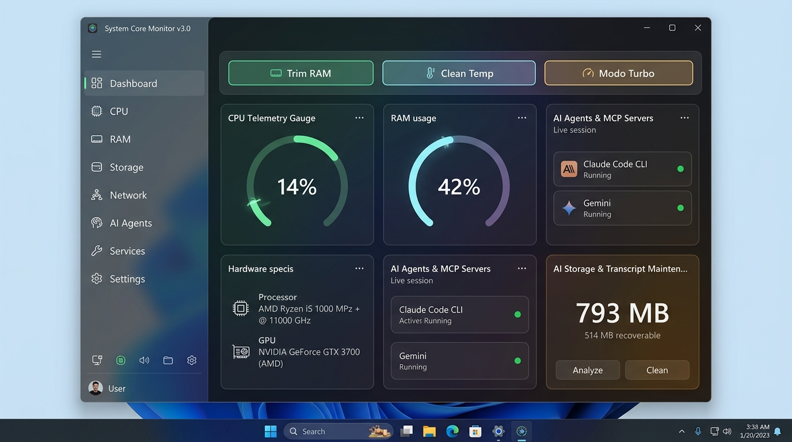

# System Core Monitor 🖥️⚡

<div align="center">

[](https://www.microsoft.com/windows)
[](https://dotnet.microsoft.com/)
[](https://github.com/AnaCataVC/simple-pc-monitor/releases/tag/v3.0.0)
[]()
[]()
[]()
[](LICENSE)

*A high-performance, lightweight, and interactive Windows desktop command center and AI observability dashboard engineered in compiled Native C# 13 (.NET 9 WPF/XAML). Features zero external dependencies, sub-millisecond Win32 P/Invoke telemetry, AI Agent & MCP Session Monitor, AI Transcript Retention & Cleanup Engine, orphaned-process detection with PID-reuse-safe tree termination, Two-Phase Graceful Process Termination, kernel-level process control (NtSuspend/NtResume), 1-click power plans, multizone hardened storage cleaning, interactive Bento metric cards, responsive multi-drive analytics, enterprise crash logging, seamless multi-monitor DPI maximization, and zero-heuristic footprint in a standalone 617 KB binary.*

[English](#english) • [Español](#español)

<br/>



</div>

---

<a name="english"></a>
## English

### 1. Project Description
**System Core Monitor v3.0.0** is an interactive desktop command center and telemetry suite built exclusively with compiled C# 13 and Windows Presentation Foundation (.NET 9 WPF). It monitors and actively manages critical system resources—**CPU, Memory (RAM), Multi-Drive Storage, Network Latency & Throughput, Real-Time Processes, AI Agents & Model Context Protocol (MCP) Sessions, AI Transcript Retention & Storage Maintenance, Windows Services, Scheduled Tasks, Startup Applications, and Hardware Accelerators (GPU/NPU)**—packaged into a single standalone `.exe` (617 KB) without third-party runtimes or background services.

---

### 2. ⚡ Command Center & Action Buttons Reference

System Core Monitor transitions from a passive observer to an **Active Command Center**. Below is the exact behavior and Win32/Kernel API mechanism behind every interactive control in the HUD:

| Action / Button | UI Location | Mechanism & Native Win32 / Kernel API | Exact Behavior & Purpose |
| :--- | :--- | :--- | :--- |
| **🚀 Turbo Mode** | Top Ribbon / Tray | Win32 `PowrProf.dll` (`PowerSetActiveScheme`) + `EmptyWorkingSet` | Instantly switches the Windows power plan to **High Performance** (unparking CPU cores) and concurrently purges idle working set memory pages across user processes to reclaim physical RAM. |
| **🤖 AI Agent & MCP Monitor** | AI Agents Tab | Win32 `CreateToolhelp32Snapshot` + `SafeProcessHandle` + `_sampleGate` + PID Reuse Gate + Snapshot Resilience | Discovers AI developer CLIs (`claude.exe`, `gemini.exe`, `codex.exe`, `aider.exe`, `ollama.exe`, `cursor.exe`, `antigravity.exe`), identifies resumed CLI sessions via hash/UUID (`--resume=`, `🔗 Sesión <8-char-hash>`), displays dynamic AI Model badges (`--model`, `🧬 <ModelName>`), decouples total child processes (`ChildProcessCount`) from verified MCP servers (`McpServersCount`), isolates ephemeral launchers (`npx`, `uvx`), detects Go/Rust compiled MCP binaries via CLI markers, promotes independent CLI sessions with tree boundary truncation, guards snapshot cache-eviction (`allRunningPids.Count > 0`), and dynamically reflects Active (Emerald `#10B981`) vs. Idle (Slate `#64748B`) states. |
| **🛑 Two-Phase Graceful Close** | Process & AI Tabs | `CloseMainWindow` / `WM_CLOSE` + Tray Detection | **Phase 1**: Dispatches a non-blocking graceful close request and detects if the app minimized to the System Tray (`MainWindowHandle == IntPtr.Zero`). **Phase 2**: Prompts for force termination only if the process remains active or unresponsive. |
| **⚡ Reverse Tree Kill** | AI Agents Tab | Reverse Topological Tree Termination + `(PID, StartTime)` Identity Gate | Terminates entire process trees in reverse topological order (leaf MCP subprocesses first $\rightarrow$ root CLI last) eliminating orphaned background processes and memory leaks. The walk refuses to descend into a process that started *before* its recorded parent, so a live process that merely inherited a recycled parent PID is never dragged into someone else's tree. |
| **🧟 Orphan Detection & Cleanup** | AI Agents Tab | Toolhelp32 Claim Diff + Dead/Recycled Parent Test + Minimum Age Gate | Lists runtime processes (`python`, `node`, `docker`, shells…) that **no live agent session claims** and whose parent is either gone or was recycled onto a different process — what an interrupted session leaves behind, such as a `multiprocessing.Pool` whose workers outlived the run. Windows has no orphan reaper, so these accumulate silently across retries. Each row shows the detection reason, age and RAM, with the sanitized command line in the tooltip; nothing is ever terminated automatically, and both the per-row and "Terminate All" actions revalidate each PID's `StartTime` before killing. |
| **🌐 Flush DNS** | Top Ribbon | Native `dnsapi.dll` (`DnsFlushResolverCache`) | Directly purges and resets the Windows DNS name resolver cache in 0.01 ms, resolving stale routes, domain lookup glitches, and network timeouts without needing CMD. |
| **🧹 Clean Temp** | Top Ribbon | Multizone `SafeTempCleaner` (>24h Cutoff) | Safely cleans obsolete cache files in `%TEMP%`, `C:\Windows\Temp`, `WinSxS\Temp`, `SoftwareDistribution\Download`, and `DeliveryOptimization`. Protected by **NTFS Reparse Point (Junction/Symlink) isolation** and **Dual Timestamp Gate** (`CreationTime` + `LastWriteTime`). |
| **🔍 Storage Scan** | Drives Tab | `FolderSizeScanner` + `IProgress<T>` / `CancellationToken` | Measures the recursive size of every first-level folder under a chosen root and ranks the heaviest, answering *where* the space went instead of only how full the volume is. Subtrees are walked in parallel, progress is throttled to one report per 150 ms, and the scan is cancellable mid-run. Reparse points are reported as skipped and **never contribute bytes**. |
| **🔎 Bloat Analysis** | Drives Tab | `BloatDetector` + `SHQueryRecycleBin` | Surfaces large consumers a per-volume bar cannot show: dynamically grown Docker/WSL VHDX files, regenerable build caches (Gradle, NuGet, npm, pip, Maven, Android), the Recycle Bin, the paging/hibernation files and the WinSxS component store — each classified by severity with a concrete remediation. |
| **🧹 Clean Cache** | Bloat Row | Whitelist-validated `SafeTempCleaner.CleanWhitelistedCache` | Deletes a regenerable cache only after an **exact match against an explicit whitelist**; arbitrary paths are refused. Inherits the dual-timestamp age gate and never follows junctions. System-owned items expose no delete action at all. |
| **⚠️ Rescue Process** | Dynamic Title Alert | Win32 `IsResponding` Watchdog + Two-Phase Close | Real-time watchdog detects windowed processes that stop responding to the Windows message loop (`IsResponding == false`). Clicking *"Rescue"* dispatches a safe two-phase close. |
| **⏸️ Suspend Process** | Process List / Context | Kernel `ntdll.dll` (`NtSuspendProcess`) | Freezes all execution threads of a CPU-intensive or runaway background task, dropping its CPU consumption to 0.0% instantly without closing the window or losing unsaved work. |
| **▶️ Resume Process** | Process List / Context | Kernel `ntdll.dll` (`NtResumeProcess`) | Safely reactivates a suspended process, restoring its threads to active scheduling immediately. |
| **🚨 Resume All** | Process Tab Toolbar | Batch `NtResumeProcess` Watchdog | Global emergency safety button that immediately unfreezes all currently suspended user processes. |
| **⚡ CPU Priority Selector** | Context Menu | Win32 `ProcessPriorityClass` (`SetPriorityClass`) | Modifies the Windows CPU scheduler priority in real time (`Realtime`, `High`, `AboveNormal`, `Normal`, `BelowNormal`, `Idle`) to prioritize gaming, compiling, or rendering. |
| **🔍 Real-Time Search** | Process Tab Toolbar | 200 ms Debounced Filter | Reactively filters active tasks by executable name, PID, or friendly business metadata without UI thread jitter. |
| **⚡ Fast In-Memory Sorting** | Process Tab Toolbar | `ApplyProcessSortingFast` + `_syncLock` | Instantly toggles between CPU % and RAM (MB) descending sorts in-memory without blocking the UI thread or triggering redundant OS process enumeration. |
| **🎛️ Interactive Bento Cards** | Main HUD Dashboard | WPF Event Routing & Filter Dispatcher | Clicking any Bento tile (CPU, RAM, GPU, Disk, Network) redirects directly to the detailed view and applies the relevant sorting filter. |
| **⚡ Trim RAM** | Memory Card / Tray | Win32 `SetProcessWorkingSetSize` / `EmptyWorkingSet` | Trims unreferenced memory pages from the process working set and executes CLR Garbage Collection. |
| **📌 Always on Top (Pin)** | Window Titlebar | WPF `Topmost` Property Toggle | Pins the telemetry window above fullscreen apps, games, or IDEs for uninterrupted monitoring. |
| **🗖 Seamless Maximization** | Window Controls | Native Win32 `WM_GETMINMAXINFO` Hook | Intercepts `0x0024` message and calculates work area via `MonitorFromWindow`, eliminating taskbar clipping and multi-monitor bleed on borderless custom chrome. |
| **🎨 4 Modern Themes** | Titlebar Palette | `ActivePillActionButtonStyle` & Dynamic Resources | Instantly swaps between **Pastel Dark**, **Pastel Light**, **Cyberpunk Neon**, and **Sakura Rose** with dynamically themed vector buttons. |

> [!TIP]
> 📖 **Deep Technical Architecture & Security Manual:** For full Mermaid execution sequence diagrams, Win32 P/Invoke invariants, and TOCTOU/Junction safety mechanics, see the dedicated **[Command Center Technical Manual](docs/command-center-guide.md)**.

---

### 3. Key Highlights & Capabilities:
- **🤖 AI Agent & MCP Session Monitor:** Real-time discovery and consolidated telemetry of developer AI sessions, resumed session identification via CLI hash/UUID (`--resume=`, `🔗 Sesión <8-char-hash>`), dynamic AI model badges (`--model`, `🧬 <ModelName>`) with null/empty-safe WPF DataTriggers, decoupled MCP vs. child counters, Toolhelp32 snapshot failure resilience (`allRunningPids.Count > 0`), cold-start PEB resilience, and dynamic Active/Idle state badges.
- **⚡ Zero-Leak Handle Architecture & Concurrency Guard:** Deterministic disposal of Win32 process handles (`SafeProcessHandle` via `using`/`Dispose()`) and anti-reentrancy synchronization (`_sampleGate`) for rock-solid CPU delta calculations under high-frequency polling.
- **🛡️ Two-Phase Graceful Close Protocol:** Safe non-blocking process termination with System Tray minimization detection and topological tree kill.
- **🧟 Orphan Detection Without Auto-Kill:** Surfaces the runtime processes an interrupted agent session abandoned — unclaimed by any live session, parent dead or recycled, older than the launcher-exit grace window — and leaves the decision to you, showing the reason, age, RAM and sanitized command line behind an explicit confirmation.
- **Responsive 100% Full-Width Bento Grid:** Eliminates dead UI margins, delivering clean, high-density telemetry across all monitor aspect ratios.
- **Enterprise Crash Logging & Exception Traps:** Centralized `CrashLogger` captures unhandled domain exceptions, unobserved task faults, and recoverable UI dispatcher errors with a 1MB size cap, sliding rate limiting, and log rotation.
- **Dedicated Multi-Drive Storage Hub:** Live partition visualizer with filesystem health, drive type detection (NVMe/SSD/HDD), activity meters, and 1-click Explorer shortcuts.
- **🔍 Storage Analyzer & Hidden Bloat Detection:** On-demand folder-size breakdown with parallel subtree walking, throttled progress and mid-run cancellation, plus detection of the space consumers a usage bar structurally cannot reveal — grown Docker/WSL virtual disks, regenerable build caches, the Recycle Bin, and system-owned paging/hibernation files labeled as such so they are never chased in vain.
- **☁️ Cloud Mount Disambiguation:** Virtual drives that Windows reports as fixed disks (Google Drive and similar) are badged and excluded from every storage calculation, so a mount mirroring the host volume never double-reports the machine's real capacity.
- **🔍 360° Process Inspector & Metadata Resolver:** Resolves human-readable application names (`FileDescription`), verified publishers (`CompanyName`), architectures, and window titles with 0ms cache overhead.
- **Protected System Process Blacklist:** Hardened guardrails strictly prevent accidental termination or suspension of essential operating system services (`csrss`, `dwm`, `svchost`, `explorer`, `services`, `lsass`).
- **ICMP Ping Latency Monitor:** Constant background network latency measurement without UI locking.
- **Diagnostic Snapshot Exporter:** Generates full Markdown health reports with one click for sharing or debugging.

---

### 4. Architecture & Modular Structure

```text
system-core-monitor/
├── src/
│   ├── SystemCoreMonitor.csproj    # C# WPF project file (.NET 9 SDK-style)
│   ├── App.xaml & App.xaml.cs      # Entrypoint, CrashLogger bootstrap & 4-theme switcher
│   ├── Core/
│   │   ├── NativeMethods.cs        # Win32 & NT kernel P/Invoke (ntdll, user32, dnsapi, powrprof, toolhelp32)
│   │   ├── CrashLogger.cs          # Resilient crash logging (1MB cap, rotation, rate limiting)
│   │   ├── PowerPlanManager.cs     # Native Win32 power scheme switcher
│   │   ├── ProcessManager.cs       # Two-phase graceful close, PID-reuse-safe tree kill & blacklist guards
│   │   ├── ProcessMetadataCache.cs # High-performance 0ms metadata caching
│   │   ├── SafeTempCleaner.cs      # Hardened multizone storage cleaner (Anti-TOCTOU & Junction safe)
│   │   ├── FileSystemSafety.cs     # Shared reparse-point guard & cloud/virtual volume classifier
│   │   ├── FolderSizeScanner.cs    # Cancellable folder-size breakdown with throttled progress
│   │   ├── BloatDetector.cs        # Hidden space consumers + whitelist-gated cache cleanup
│   │   ├── MemoryOptimizer.cs      # Working set trim & CLR GC collector
│   │   ├── SnapshotExporter.cs     # System diagnostic report generator
│   │   ├── ConfigManager.cs        # Persistent settings in %APPDATA%
│   │   └── ToolLauncher.cs         # Safe Windows diagnostic launchers
│   ├── Models/
│   │   ├── SystemMetrics.cs        # Strongly typed telemetry DTOs & process models
│   │   └── AiAgentSession.cs       # AI Agent & MCP session and subprocess hierarchy models
│   ├── Modules/
│   │   ├── CpuCollector.cs         # GetSystemTimes P/Invoke delta math
│   │   ├── MemoryCollector.cs      # GlobalMemoryStatusEx RAM & PageFile
│   │   ├── DiskCollector.cs        # DriveInfo multi-volume evaluator
│   │   ├── NetworkCollector.cs     # NetworkInterface live Rx/Tx & ICMP Ping
│   │   ├── ProcessCollector.cs     # Thread-safe debounced process sampler (_syncLock + fast sorting)
│   │   ├── AiAgentCollector.cs     # Toolhelp32 process tree scanner, MCP session aggregator & orphan detector
│   │   ├── ServiceCollector.cs     # Windows ServiceController census
│   │   ├── HardwareCollector.cs    # Battery status, uptime, OS/CPU/GPU specs
│   │   └── StartupCollector.cs     # Registry & Startup folder enumerator
│   └── UI/
│       ├── MainWindow.xaml & .cs   # Interactive HUD, Bento grid, AI Agents Tab, WM_GETMINMAXINFO hook
│       ├── ProcessDetailsWindow.xaml & .cs # 360° modal process inspector dialog
│       └── Themes/                 # Dynamic Pastel Dark, Light, Neon & Rose palettes + CommonStyles
├── scripts/
│   └── Build-Package.ps1           # MSBuild dynamic resolver & packaging pipeline
├── tests/
│   ├── Metrics.Tests.ps1           # 19-Test Health & Reflection validation suite
│   └── DeepStress.Tests.ps1        # 6-Test Live Process Tree, PID Reuse Guard, Handle Leak & Smoke suite
└── releases/                       # Standalone .exe, Setup installer & Portable ZIP
```

---

### 5. Setup & Build Instructions

#### Direct Launch:
Run the compiled standalone executable inside `releases/`:
```powershell
.\releases\SystemCoreMonitor.exe
```

#### Build from Source:
```powershell
powershell -ExecutionPolicy Bypass -File .\scripts\Build-Package.ps1 -Version "v3.0.0"
```

#### Run Automated Health & Stress Tests (30 Tests):
All suites load the binary from `releases/` using the .NET 9 runtime, so build the package first on a fresh clone.
```powershell
# 1. Health and Type Tests (19 tests)
pwsh -ExecutionPolicy Bypass -File .\tests\Metrics.Tests.ps1

# 2. AI Transcript Retention & Cleanup Tests (5 tests)
pwsh -ExecutionPolicy Bypass -File .\tests\AiTranscript.Tests.ps1

# 3. Deep Stress, PID Reuse Guard, Handle Leaks & Smoke Tests (6 tests)
pwsh -ExecutionPolicy Bypass -File .\tests\DeepStress.Tests.ps1
```

---

### 6. Key Learnings & Engineering Takeaways
1. **AI Agent & MCP Process Tree Discovery & Subprocess Classification:** Using `CreateToolhelp32Snapshot` enables atomic process hierarchy mapping in $<0.8\text{ ms}$. Accurately classifying child processes requires inspecting command-line markers (`--stdio`, `mcp-remote`, `modelcontextprotocol`, `/mcp`) rather than relying on host runtimes (`node.exe`, `python.exe`), enabling discovery of compiled Go and Rust MCP servers while discarding generic build tools or language servers. Separating total child processes (`ChildProcessCount`) from verified MCP servers (`McpServersCount`), isolating ephemeral package runners (`npx`, `uvx`), promoting nested CLI agent sessions to their own roots with session-boundary tree pruning, wrapping native process handles in deterministic `SafeProcessHandle` disposals (`using`/`Dispose()`), and guarding time-series CPU deltas with re-entrancy locks (`_sampleGate`) eliminates handle table exhaustion and metric duplication across parent IDEs and child sessions.
2. **Triple PID Reuse Mitigation Gate:** Windows reassigns PIDs rapidly upon process termination. Storing and verifying `child.StartTime >= parent.StartTime.AddSeconds(-2)` prevents false-positive parent-child associations when examining long-running developer sessions.
3. **Two-Phase Termination & Reverse Topological Tree Termination:** When closing complex applications, Phase 1 dispatches non-blocking graceful close signals (`CloseMainWindow` / `WM_CLOSE` / `AttachConsole` + `CTRL_C_EVENT`) and detects if the window minimized to the System Tray (`MainWindowHandle == IntPtr.Zero`). Escalating to Phase 2 terminates child MCP leaves before root CLI orchestrators, eliminating orphaned background processes and locked ports.
4. **Anti-Reparse Point / Junction Security:** Traditional recursive directory cleaners follow NTFS Junction Points and Symlinks into user data folders. Validating `FileAttributes.ReparsePoint` and enforcing dual timestamps (`CreationTime` + `LastWriteTime`) provides absolute sandbox isolation.
5. **Kernel-Level Thread Suspension (`ntdll.dll`):** Invoking `NtSuspendProcess` and `NtResumeProcess` directly allows freezing resource-hogging background tasks without corrupting their state or losing application sessions.
6. **Seamless Multi-Monitor Window Maximization (`WM_GETMINMAXINFO`):** Handling Win32 `0x0024` and extracting per-monitor work area dimensions via `MonitorFromWindow` eliminates window clipping across high-DPI and multi-monitor setups.
7. **Resilient Crash Trapping Architecture (`CrashLogger.cs`):** Multi-tier exception hooking across `AppDomain`, `TaskScheduler`, and `Dispatcher` with 1MB size caps and 5-log/10s rate limiting prevents diagnostic spam and application crashes from unobserved background threads.
8. **Resilient Session Context & Cache Eviction Safeguards:** Headless or resumed autonomous CLI agents frequently lack window titles; System Core Monitor resolves these via regex CLI inspection (`--resume=`) into compact session hashes (`🔗 Sesión <8-char-hash>`) and extracts active AI models (`--model`) displayed as `🧬 <ModelName>`. In WPF XAML, dual null-and-empty `DataTriggers` (`Value=""` and `Value="{x:Null}"`) guarantee seamless visual collapse when no model flag exists. Crucially, cache eviction passes across CPU delta histories, resolved session metadata, and UI collapse states (`CollapsedSessionPids`) are protected behind an `allRunningPids.Count > 0` boundary check, preventing catastrophic cache purges if a transient OS snapshot call fails under high resource contention.
9. **Recursive Enumeration Cannot Use `SearchOption.AllDirectories`:** `EnumerateFiles`/`EnumerateFileSystemInfos` with `AllDirectories` raises `UnauthorizedAccessException` from *inside* the deferred iterator, aborting the entire walk with no way to skip the offending branch and resume — a single protected folder silently truncates a whole-drive scan. The same applies to `PathTooLongException` on deeply nested dependency trees. Correct traversal is manual recursion over `TopDirectoryOnly` with per-directory exception handling, guarding `MoveNext()` itself, so one unreadable directory costs that directory and nothing more.
10. **Reparse Points Invent Storage That Does Not Exist:** Junctions, symlinks and cloud placeholders project data that lives elsewhere — another volume, a remote service, or a paired mobile device. Any size aggregation that follows them reports space the physical volume does not contain, and the error is large enough to dominate a report. Every traversal must test `FileAttributes.ReparsePoint`, exclude those entries from all totals, and surface them as explicitly *skipped* so the discrepancy between a scan total and the volume's used space is visible rather than mysterious. The attribute check must fail closed: if attributes cannot be read, assume a reparse point and refuse to descend.
11. **A Fixed FAT32 Volume Above 32 GB Is Impossible:** Windows refuses to format FAT32 beyond 32 GB, so a drive simultaneously reporting `DriveType.Fixed`, FAT32 and a capacity above that cap is a cloud or virtual mount surfacing through a filesystem filter, not physical storage. Such mounts typically mirror the host volume's capacity, so counting them double-reports the machine's real storage. Checking whether the drive root is a reparse point does *not* detect them — the mount presents a normal root directory.
12. **Windows Never Clears a Recorded Parent PID, So a Process Tree Is Not What `PPID` Says It Is:** A process keeps its parent's PID long after that parent dies, and Windows hands the freed number to something new. Walking `PPID` edges therefore reaches live, unrelated processes that merely inherited the number — measurable at any moment on a normal desktop, and dense precisely where orphans are, since old abandoned processes are the ones most likely to hold a recycled number. The invariant that restores the real tree is that **a process cannot start before its own parent**: an edge whose child predates its parent is an artifact and must not be traversed. This matters most on the destructive path, where a wrong edge does not display a bad number, it kills someone's work. For the same reason a PID captured in a previous sample is revalidated against its `StartTime` immediately before terminating: between the scan, a modal confirmation and a bulk loop that waits on each exit, the number can change owner.
13. **Dynamically Expanding Virtual Disks Never Shrink:** VHDX files backing Docker Desktop's WSL2 engine and WSL distributions grow as data is written but do not release blocks when it is deleted. The file size on disk therefore says nothing about how much is stored inside, and reclaiming the space requires compacting the image rather than deleting anything. Reporting the file size alone is honest and useful; inferring internal usage would require mounting the image or depending on an external CLI, neither of which belongs in a dependency-free binary.

---

<a name="español"></a>
## Español

### 1. Descripción del Proyecto
**System Core Monitor v3.0.0** es un centro de mando interactivo y panel de telemetría de alto rendimiento desarrollado exclusivamente en C# (.NET 9) y Windows Presentation Foundation (WPF). Monitorea y gestiona de forma activa los recursos críticos del sistema—**CPU, Memoria RAM, Almacenamiento Multidisco, Red y Latencia Ping, Procesos en Tiempo Real, Sesiones de Agentes de IA y Servidores MCP, Mantenimiento de Transcripciones y Logs de IA, Servicios de Windows, Tareas Programadas, Programas de Inicio y Aceleradores de Hardware (GPU/NPU)**—en un único ejecutable standalone de **617 KB** sin dependencias NuGet externas.

---

### 2. ⚡ Guía de Botones de Acción y Centro de Mando

System Core Monitor evoluciona de un monitor pasivo a un **Centro de Mando Activo**. A continuación se detalla el comportamiento exacto y la API nativa detrás de cada control interactivo:

| Botón / Acción | Ubicación en UI | API Win32 / Kernel Utilizada | Comportamiento y Propósito Exacto |
| :--- | :--- | :--- | :--- |
| **🚀 Modo Turbo** | Ribbon Superior / Bandeja | Win32 `PowrProf.dll` (`PowerSetActiveScheme`) + `EmptyWorkingSet` | Activa al instante el plan de energía de **Alto Rendimiento** de Windows (desestaciona núcleos de CPU) y ejecuta simultáneamente una purga agresiva del *working set* de memoria RAM en procesos de usuario. |
| **🤖 Monitor de Agentes IA & MCP** | Pestaña Agentes IA | Win32 `CreateToolhelp32Snapshot` + `SafeProcessHandle` + `_sampleGate` + Guarda PID Reuse + Resiliencia Snapshot | Detecta herramientas CLI de IA (`claude.exe`, `gemini.exe`, `codex.exe`, `aider.exe`, `ollama.exe`, `cursor.exe`, `antigravity.exe`), identifica sesiones CLI reanudadas por hash/UUID (`--resume=`, `🔗 Sesión <8-char-hash>`), visualiza badges dinámicos del Modelo de IA (`--model`, `🧬 <ModelName>`), desacopla subprocesos totales (`ChildProcessCount`) de servidores MCP verificados (`McpServersCount`), aísla lanzadores efímeros (`npx`, `uvx`), detecta servidores MCP compilados en Go/Rust por flags CLI, promueve sesiones CLI independientes con corte de fronteras en el árbol, blinda el vaciado de cachés ante fallos de snapshot (`allRunningPids.Count > 0`), y refleja dinámicamente estados Activo (Esmeralda `#10B981`) vs Inactivo (Pizarra `#64748B`). |
| **🗄️ Transcripts IA** | Ribbon Superior / Pestaña IA | `AiTranscriptMaintenance` + Filtro de Retención (>7 días) | Escaneo seguro y auditoría de almacenamiento para transcripciones y logs de sesiones de CLI de IA (Claude Code, Gemini CLI). Purga selectiva con umbral configurable y exclusión de subagentes activos sin inspección de contenido. |
| **🛑 Cierre Ordenado en Dos Fases** | Pestañas Procesos e IA | `CloseMainWindow` / `WM_CLOSE` + Detección Tray | **Fase 1**: Envío no bloqueante de solicitud de cierre ordenado y detección inteligente de minimizado a la Bandeja del Sistema (`MainWindowHandle == IntPtr.Zero`). **Fase 2**: Confirmación para forzar cierre solo si continúa activo o colgado. |
| **⚡ Terminar Árbol (Tree Kill)** | Pestaña Agentes IA | Terminación Topológica Inversa + Compuerta de Identidad `(PID, StartTime)` | Finaliza árboles de procesos completos en orden topológico inverso (subprocesos MCP primero $\rightarrow$ proceso raíz al final), evitando procesos huérfanos zombis. El recorrido se niega a descender hacia un proceso que arrancó *antes* que su padre registrado, de modo que un proceso vivo que solo heredó un PID de padre reciclado nunca se arrastra dentro del árbol ajeno. |
| **🧟 Detección y Limpieza de Huérfanos** | Pestaña Agentes IA | Diferencia de Reclamo Toolhelp32 + Prueba de Padre Muerto/Reasignado + Edad Mínima | Lista los procesos de runtime (`python`, `node`, `docker`, shells…) que **ninguna sesión de agente viva reclama** y cuyo padre ya no existe o fue reasignado a otro proceso — lo que deja atrás una sesión interrumpida, por ejemplo un `multiprocessing.Pool` cuyos workers sobrevivieron a la corrida. Windows no tiene un recolector de huérfanos, así que se acumulan en silencio entre reintentos. Cada fila muestra el motivo de detección, la antigüedad y la RAM, con la línea de comandos saneada en el tooltip; nada se termina automáticamente, y tanto la acción por fila como "Terminar Todos" revalidan el `StartTime` de cada PID antes de matar. |
| **🌐 Vaciar DNS** | Ribbon Superior | Nativa `dnsapi.dll` (`DnsFlushResolverCache`) | Purga y reinicia la caché del solucionador de nombres DNS de Windows en 0.01 ms, corrigiendo errores de navegación y resolución de dominios sin abrir CMD. |
| **🧹 Limpiar Temporales** | Ribbon Superior | Multizona `SafeTempCleaner` (>24h Cutoff) | Limpieza segura de archivos temporales en `%TEMP%`, `C:\Windows\Temp`, `WinSxS\Temp`, `SoftwareDistribution\Download` y `DeliveryOptimization`. Blindado con **aislamiento de Junctions/Symlinks** y **Guarda de Doble Marca de Tiempo** (`CreationTime` + `LastWriteTime`). |
| **🔍 Escanear Almacenamiento** | Pestaña Discos | `FolderSizeScanner` + `IProgress<T>` / `CancellationToken` | Mide el tamaño recursivo de cada carpeta de primer nivel bajo una raíz elegida y ordena las más pesadas, respondiendo *dónde* se fue el espacio en vez de solo cuán lleno está el volumen. Los subárboles se recorren en paralelo, el progreso se limita a un reporte cada 150 ms y el escaneo se puede cancelar a mitad de camino. Los reparse points se reportan como omitidos y **nunca aportan bytes**. |
| **🔎 Análisis de Bloat** | Pestaña Discos | `BloatDetector` + `SHQueryRecycleBin` | Expone los grandes consumidores que una barra por volumen no puede mostrar: discos virtuales Docker/WSL (VHDX) que crecieron, cachés de compilación regenerables (Gradle, NuGet, npm, pip, Maven, Android), la papelera, los archivos de paginación/hibernación y el almacén de componentes WinSxS — cada uno clasificado por severidad y con una remediación concreta. |
| **🧹 Limpiar Caché** | Fila de Bloat | `SafeTempCleaner.CleanWhitelistedCache` validado por whitelist | Borra una caché regenerable solo tras una **coincidencia exacta contra una whitelist explícita**; cualquier ruta arbitraria se rechaza. Hereda la guarda de antigüedad de doble marca de tiempo y nunca sigue junctions. Los elementos del sistema no exponen acción de borrado. |
| **⚠️ Rescatar Proceso** | Alerta en Barra de Título | Watchdog Win32 `IsResponding` + Cierre en Dos Fases | Detecta en vivo procesos con ventanas que no responden a la cola de mensajes de Windows (`IsResponding == false`). El botón *"Rescatar"* ejecuta el protocolo seguro de cierre en dos fases. |
| **⏸️ Suspender Proceso** | Lista de Procesos / Contexto | Kernel `ntdll.dll` (`NtSuspendProcess`) | Congela todos los hilos de ejecución de un proceso desbocado, reduciendo su consumo de CPU al 0.0% instantáneamente sin cerrarlo ni perder el trabajo abierto. |
| **▶️ Resume Process** | Lista de Procesos / Contexto | Kernel `ntdll.dll` (`NtResumeProcess`) | Reactiva un proceso previamente suspendido, devolviendo sus hilos al planificador de tareas de Windows. |
| **🚨 Reanudar Todos** | Barra de Pestaña Procesos | Batch `NtResumeProcess` Watchdog | Botón de seguridad global que descongela simultáneamente todos los procesos de usuario suspendidos. |
| **⚡ Prioridad de CPU** | Menú Contextual | Win32 `ProcessPriorityClass` (`SetPriorityClass`) | Modifica la prioridad del proceso en el planificador del procesador (`Tiempo Real`, `Alta`, `Normal`, `Baja`, `Inactiva`) para priorizar juegos o renderizados. |
| **🔍 Búsqueda en Vivo** | Barra de Pestaña Procesos | Filtro Reactivo con Debounce de 200 ms | Filtra al instante por ejecutable, PID o nombre comercial de la aplicación sin congelar la interfaz. |
| **⚡ Ordenación Rápida en Memoria** | Barra de Pestaña Procesos | `ApplyProcessSortingFast` + `_syncLock` | Alterna instantáneamente entre orden descendente por CPU % y RAM (MB) en memoria sin bloquear la interfaz ni repetir escaneos del sistema operativo. |
| **🎛️ Tarjetas Bento Clicables** | Panel Principal (HUD) | Enrutamiento de Eventos WPF | Al hacer clic en cualquier tarjeta (CPU, RAM, GPU, Disco, Red) redirige a la pestaña de detalle y aplica el filtro relevante. |
| **⚡ Optimizar RAM** | Tarjeta Memoria / Bandeja | Win32 `SetProcessWorkingSetSize` / `EmptyWorkingSet` | Vierte las páginas de memoria no referenciadas del proceso físico al archivo de paginación y ejecuta recolección de basura CLR. |
| **📌 Fijar Ventana (Pin)** | Barra de Título | Propiedad `Topmost` de WPF | Mantiene la ventana por encima de juegos o aplicaciones a pantalla completa para monitorización continua. |
| **🗖 Maximizado Preciso** | Controles de Ventana | Hook Nativo Win32 `WM_GETMINMAXINFO` | Intercepta el mensaje `0x0024` y calcula el área de trabajo mediante `MonitorFromWindow`, evitando que la ventana tape la barra de tareas o se desborde en múltiples pantallas. |
| **🎨 4 Temas Visuales** | Paleta en Barra de Título | `ActivePillActionButtonStyle` y Recursos Dinámicos | Alterna al instante entre **Pastel Oscuro**, **Pastel Claro**, **Cyberpunk Neón** y **Sakura Rosa** con botones vectoriales de estilo adaptativo. |

> [!TIP]
> 📖 **Manual Técnico y de Seguridad en Detalle:** Si deseas consultar los diagramas de secuencia Mermaid, invariantes de llamadas nativas P/Invoke y el blindaje TOCTOU/Junctions, revisa el **[Manual Técnico del Centro de Mando](docs/command-center-guide.md)**.

---

### 3. Características Nativas Destacadas:
- **🤖 Monitor de Agentes IA & Servidores MCP:** Detección en tiempo real de sesiones de herramientas de IA CLI y subprocesos MCP hijos con métricas desacopladas, identificación de sesiones reanudadas por hash (`--resume=`, `🔗 Sesión <8-char-hash>`), badge condicional de modelo (`--model`, `🧬 <ModelName>`) con DataTriggers resistentes a null/cadenas vacías, blindaje de vaciado de caché Toolhelp32 (`allRunningPids.Count > 0`), tolerancia a cold-start de PEB y badges dinámicos de estado Activo/Idle.
- **🗄️ Mantenimiento de Transcripciones y Logs de IA:** Auditoría y purga no invasiva de historiales JSONL acumulados por herramientas de IA CLI (Claude Code, Gemini CLI) con protección de sesiones recientes (>7 días), exclusión de subagentes activos y preservación de privacidad.
- **⚡ Arquitectura Cero Fugas de Handles y Cerrojo Anti-Reentrada:** Disposición determinista de handles Win32 (`SafeProcessHandle` mediante `using`/`Dispose()`) y cerrojo anti-reentrada `_sampleGate` para cálculo estable de deltas de CPU bajo alta frecuencia de muestreo.
- **🛡️ Protocolo de Cierre en Dos Fases:** Cierre seguro y no bloqueante con detección de aplicaciones minimizadas a la Bandeja del Sistema (*System Tray*) y terminación topológica inversa.
- **🧟 Detección de Huérfanos sin Matar Solo:** Expone los procesos de runtime que dejó atrás una sesión de agente interrumpida — sin reclamar por ninguna sesión viva, con el padre muerto o reasignado, y más antiguos que la ventana de gracia de arranque — y deja la decisión en tus manos, mostrando el motivo, la antigüedad, la RAM y la línea de comandos saneada detrás de una confirmación explícita.
- **Diseño Bento a Ancho Completo:** Cuadrícula de alta densidad sin márgenes muertos, optimizada para resoluciones modernas.
- **Registro Resiliente de Fallos (`CrashLogger.cs`):** Captura global de excepciones en `AppDomain`, `TaskScheduler` y `Dispatcher` con rotación automática a 1MB y límite de tasa de 5 registros cada 10 segundos.
- **Centro de Almacenamiento Multidisco:** Visualizador en tiempo real de unidades de disco (NVMe/SSD/HDD), estado de salud, espacio libre y accesos directos al Explorador de archivos.
- **🔍 Analizador de Almacenamiento y Detección de Bloat Oculto:** Desglose de tamaño por carpeta bajo demanda, con recorrido paralelo de subárboles, progreso limitado y cancelación a mitad de camino, más la detección de los consumidores de espacio que una barra de uso no puede revelar por diseño — discos virtuales Docker/WSL que crecieron, cachés de compilación regenerables, la papelera, y los archivos de paginación/hibernación etiquetados como del sistema para que nadie los persiga en vano.
- **☁️ Desambiguación de Unidades en la Nube:** Las unidades virtuales que Windows reporta como discos fijos (Google Drive y similares) se marcan con un badge y se excluyen de todo cálculo de almacenamiento, evitando que un montaje que refleja el volumen anfitrión duplique la capacidad real del equipo.
- **🔍 Inspector 360° de Procesos:** Identificación amigable de nombres comerciales, publicadores certificados, arquitectura y memoria con 0ms de retardo.
- **Lista Negra de Protección del Sistema:** Protección estricta que previene la suspensión o cierre de procesos vitales del sistema (`csrss`, `dwm`, `svchost`, `explorer`, `services`, `lsass`).
- **Pipeline de CI/CD Automatizado:** Compilación y ejecución de 30 tests automatizados de salud, transcripciones de IA, estrés en vivo y arquitectura en cada release.

---

### 4. Instrucciones de Compilación y Ejecución

#### Ejecutar Directamente:
```powershell
.\releases\SystemCoreMonitor.exe
```

#### Compilar desde el Código Fuente:
```powershell
powershell -ExecutionPolicy Bypass -File .\scripts\Build-Package.ps1 -Version "v3.0.0"
```

#### Ejecutar Pruebas Automatizadas (30 Tests):
Todas las suites cargan el binario desde `releases/` mediante el runtime de .NET 9, por lo que en un clon nuevo hay que compilar el paquete primero.
```powershell
# 1. Pruebas de Salud y Arquitectura (19 tests)
pwsh -ExecutionPolicy Bypass -File .\tests\Metrics.Tests.ps1

# 2. Pruebas de Mantenimiento de Transcripciones de IA (5 tests)
pwsh -ExecutionPolicy Bypass -File .\tests\AiTranscript.Tests.ps1

# 3. Pruebas de Estrés en Vivo, Guarda de Reuso de PID, Fugas de Handles y Smoke (6 tests)
pwsh -ExecutionPolicy Bypass -File .\tests\DeepStress.Tests.ps1
```

---

## 📄 License
MIT License. Free for personal and commercial use.
