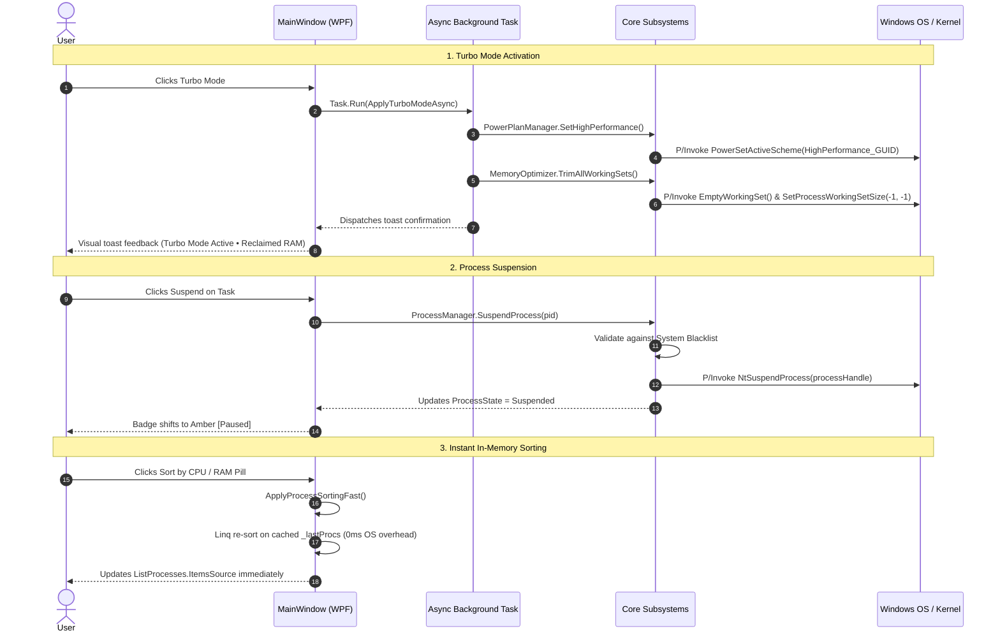
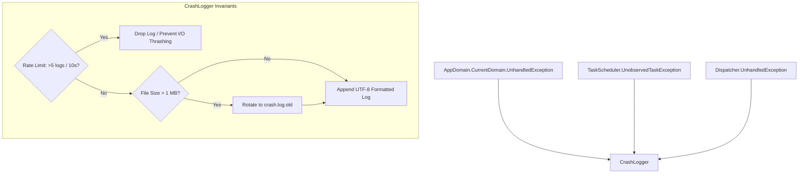

# ⚡ Simple PC Monitor — Command Center & Action Buttons Technical Manual

This document provides a comprehensive technical breakdown of the interactive controls, Win32 / NT kernel P/Invoke mechanisms, concurrency invariants, windowing architectures, crash resilience, and security guardrails implemented in **Simple PC Monitor v2.0.0**.

---

## 📑 Table of Contents
1. [Overview & Execution Philosophy](#1-overview--execution-philosophy)
2. [Command Center Architecture & Lifecycle](#2-command-center-architecture--lifecycle)
3. [Deep Dive: Quick Ribbon Actions](#3-deep-dive-quick-ribbon-actions)
   - [3.1 Turbo Mode (High Performance + Working Set Purge)](#31-turbo-mode-high-performance--working-set-purge)
   - [3.2 Instant DNS Resolver Flushing](#32-instant-dns-resolver-flushing)
   - [3.3 Multizone Hardened Temp Storage Cleaner](#33-multizone-hardened-temp-storage-cleaner)
   - [3.4 Hung Application Rescue Watchdog](#34-hung-application-rescue-watchdog)
4. [Deep Dive: Real-Time Process Management](#4-deep-dive-real-time-process-management)
   - [4.1 Thread Freezing (NtSuspendProcess) & Resuming (NtResumeProcess)](#41-thread-freezing-ntsuspendprocess--resuming-ntresumeprocess)
   - [4.2 Dynamic CPU Scheduler Priority Control](#42-dynamic-cpu-scheduler-priority-control)
   - [4.3 Concurrency Protection & In-Memory Fast Sorting](#43-concurrency-protection--in-memory-fast-sorting)
5. [Native Windowing & Multi-Monitor Custom Chrome](#5-native-windowing--multi-monitor-custom-chrome)
   - [5.1 WM_GETMINMAXINFO & Per-Monitor Work Area Calculation](#51-wm_getminmaxinfo--per-monitor-work-area-calculation)
   - [5.2 Dynamic Border, Corner Radius & Shadow Transitions](#52-dynamic-border-corner-radius--shadow-transitions)
6. [Enterprise Crash Logging Architecture](#6-enterprise-crash-logging-architecture)
   - [6.1 3-Layer Exception Trapping](#61-3-layer-exception-trapping)
   - [6.2 Sliding Rate Limiter & Disk Protection](#62-sliding-rate-limiter--disk-protection)
   - [6.3 1MB Size Cap & Log Rotation](#63-1mb-size-cap--log-rotation)
7. [Security Invariants & Crash Prevention](#7-security-invariants--crash-prevention)
   - [7.1 Protected System Process Blacklist](#71-protected-system-process-blacklist)
   - [7.2 NTFS Reparse Point (Junction / Symlink) Isolation](#72-ntfs-reparse-point-junction--symlink-isolation)
   - [7.3 Dual Timestamp Gate & TOCTOU Defense](#73-dual-timestamp-gate--toctou-defense)

---

## 1. Overview & Execution Philosophy

Simple PC Monitor v2.0.0 is engineered with an **Active Command Center** philosophy:
- **Zero Heavy Runtimes:** Executes as a single compiled C# WPF binary (<600 KB) with zero third-party dependencies.
- **Sub-Millisecond Direct OS Integration:** Interacts directly with native Windows dynamic-link libraries (`ntdll.dll`, `kernel32.dll`, `user32.dll`, `powrprof.dll`, `dnsapi.dll`, `psapi.dll`).
- **Zero-Elevation Where Possible:** Critical actions like Power Plan switching, DNS flushing, memory trimming, and process suspension operate cleanly in standard user context without triggering aggressive UAC prompts.

---

## 2. Command Center Architecture & Lifecycle

The following Mermaid diagram illustrates how user actions propagate through the UI layer, background worker threads, and native Win32/kernel APIs:

---

## 3. Deep Dive: Quick Ribbon Actions

### 3.1 Turbo Mode (High Performance + Working Set Purge)
- **Primary Goal:** Maximize CPU responsiveness for latency-sensitive tasks (gaming, compiling, 3D rendering) while freeing maximum physical RAM.
- **Win32 APIs:**
  - `PowrProf.dll` (`PowerSetActiveScheme`): Unparks CPU cores and switches to High Performance scheme.
  - `psapi.dll` (`EmptyWorkingSet`) / `kernel32.dll` (`SetProcessWorkingSetSize`): Flushes unreferenced memory pages from working sets.
- **Execution Mechanism:**
  1. Activates High Performance GUID (`8c5e7fda-e8bf-4a96-9a85-a6e23a8c635c`).
  2. Concurrently enumerates non-system user processes and executes `EmptyWorkingSet(handle)` to release physical RAM pages.
  3. Triggers CLR Garbage Collection (`GC.Collect()`) on the monitoring process.

### 3.2 Instant DNS Resolver Flushing
- **Primary Goal:** Clear stale routing tables, DNS resolution errors, and cached records without opening administrative terminal sessions.
- **Win32 API:**
  - `dnsapi.dll` (`DnsFlushResolverCache`): Native call executing in <0.01 ms, clearing the Windows DNS resolver cache equivalent to `ipconfig /flushdns`.

### 3.3 Multizone Hardened Temp Storage Cleaner
- **Primary Goal:** Safely purge obsolete temporary files without compromising running installers, user configurations, or system integrity.
- **Target Directories:**
  1. `%TEMP%` (Current User temporary storage).
  2. `C:\Windows\Temp` (System temporary staging area).
  3. `C:\Windows\WinSxS\Temp` (Component servicing temporary files).
  4. `C:\Windows\SoftwareDistribution\Download` (Orphaned Windows Update staging payloads).
  5. `C:\ProgramData\Microsoft\Windows\DeliveryOptimization` (P2P cache fragments).
- **Safety Mechanisms:**
  - Files are filtered with a strict **24-hour minimum age cutoff**.
  - In-use files locked by active processes are skipped cleanly without throwing fatal exceptions.
  - Absolute exclusions guard developer caches (`.claude`, `.antigravity`), cloud sync clients (`OneDrive`, `GoogleDrive`), and modern Windows App packages (`Packages`).

### 3.4 Hung Application Rescue Watchdog
- **Primary Goal:** Identify and recover frozen applications that lock up the desktop.
- **Mechanism:**
  - During telemetry refresh, the process enumerator inspects `process.Responding` (which sends a non-blocking `WM_NULL` probe via Win32 `SendMessageTimeout`).
  - If a process with an active window handle returns `Responding == false`, an alert banner illuminates in the title bar.
  - Clicking *Rescue* terminates the hung process gracefully via `Process.Kill()`, immediately restoring desktop responsiveness.

---

## 4. Deep Dive: Real-Time Process Management

### 4.1 Thread Freezing (`NtSuspendProcess`) & Resuming (`NtResumeProcess`)
- **Native Kernel APIs (`ntdll.dll`):**
  - `NtSuspendProcess(IntPtr processHandle)`: Freezes all active execution threads of the target process at the kernel scheduling level.
  - `NtResumeProcess(IntPtr processHandle)`: Unfreezes threads, restoring active execution.
- **Operational Flow:**
  - Unlike `Process.Kill()`, `NtSuspendProcess` drops CPU consumption to **0.0%** instantly without closing the window or losing unsaved work.
  - Clicking `NtResumeProcess` or the global *"🚨 Resume All"* safety button reactivates all suspended threads.

### 4.2 Dynamic CPU Scheduler Priority Control
- **Mechanism:** Modifies the process base priority in the Windows scheduler via `process.PriorityClass`:
  - `RealTime` (Priority 24 — Requires elevation, reserved for critical timing).
  - `High` (Priority 13 — Prioritized for compilation, gaming, rendering).
  - `AboveNormal` (Priority 10).
  - `Normal` (Priority 8 — Standard Windows default).
  - `BelowNormal` (Priority 6 — Background renderers).
  - `Idle` (Priority 4 — Runs only when CPU has idle cycles).

### 4.3 Concurrency Protection & In-Memory Fast Sorting
- **`_syncLock` Concurrency Barrier:**
  - In `ProcessCollector.cs`, access to `_prevCpuSamples` dictionary (PID -> `Tuple<TimeSpan, DateTime>`) is strictly synchronized with a private lock object.
  - Dead PID cleanup passes safely purge exited processes without race conditions against asynchronous collector tasks.
- **`ApplyProcessSortingFast()` In-Memory Linq Sorting:**
  - When switching between CPU % and RAM sorting modes, `MainWindow.xaml.cs` re-sorts the in-memory `_lastProcs` cache directly.
  - Avoids triggering costly Win32 process enumeration loops during UI interactions.

---

## 5. Native Windowing & Multi-Monitor Custom Chrome

### 5.1 `WM_GETMINMAXINFO` & Per-Monitor Work Area Calculation
Custom chrome WPF windows (`WindowStyle="None"`, `AllowsTransparency="True"`) inherently encounter Windows DWM boundary issues where maximizing causes the window to span beneath the taskbar or overflow onto secondary monitors.

**Win32 Solution in `MainWindow.xaml.cs`:**
1. Installs an `HwndSource` message hook in `OnSourceInitialized`.
2. Intercepts `WM_GETMINMAXINFO` (`0x0024`).
3. Calls `MonitorFromWindow(hwnd, MONITOR_DEFAULTTONEAREST)` to detect the active monitor.
4. Invokes `GetMonitorInfo(hMonitor, ref mi)` to obtain exact `rcWork` (excluding taskbar) and `rcMonitor` rectangles.
5. Populates `MINMAXINFO` structure:
   - `ptMaxPosition.X = Math.Abs(rcWork.Left - rcMonitor.Left)`
   - `ptMaxPosition.Y = Math.Abs(rcWork.Top - rcMonitor.Top)`
   - `ptMaxSize.X = Math.Abs(rcWork.Right - rcWork.Left)`
   - `ptMaxSize.Y = Math.Abs(rcWork.Bottom - rcWork.Top)`
   - `ptMinTrackSize = (380, 88)`

### 5.2 Dynamic Border, Corner Radius & Shadow Transitions
In `MainWindow_StateChanged`:
- **When Maximized:** `Margin = 0`, `CornerRadius = 0`, `BorderThickness = 0`, `Effect = null` (eliminating shadow bleed into adjacent displays).
- **When Restored/Normal:** `Margin = 8`, `CornerRadius = 14`, `BorderThickness = 1`, `Effect = _cachedShadowEffect` (restoring modern rounded corners and elevation shadow).

---

## 6. Enterprise Crash Logging Architecture

`CrashLogger.cs` provides a production-grade diagnostic and crash prevention subsystem:

### 6.1 3-Layer Exception Trapping
- **`AppDomain.UnhandledException`**: Captures critical unhandled errors before process termination.
- **`TaskScheduler.UnobservedTaskException`**: Catches unobserved background async faults and marks `e.SetObserved()` to avoid CLR termination.
- **`Dispatcher.UnhandledException`**: Traps recoverable UI thread glitches, marks `e.Handled = true`, and logs the fault without taking down the application.

### 6.2 Sliding Rate Limiter & Disk Protection
Maintains a rolling 10-second window (`_recentCrashCount`). If more than 5 exceptions occur within 10 seconds, logging is throttled to prevent disk saturation and I/O thrashing.

### 6.3 1MB Size Cap & Log Rotation
Before appending to `%LOCALAPPDATA%\SimplePCMonitor\Logs\crash.log`, `CrashLogger` inspects file size. If size exceeds 1,048,576 bytes, the existing log is moved to `crash.log.old`, maintaining an evergreen, zero-maintenance footprint.

---

## 7. Security Invariants & Crash Prevention

### 7.1 Protected System Process Blacklist
To prevent accidental system crashes or Blue Screens of Death (BSOD), `ProcessManager.cs` enforces an inviolable blacklist combined with `proc.SessionId == 0` and `pid <= 4` boundary checks:

| Protected Process | Subsystem Role | Consequence of Termination |
| :--- | :--- | :--- |
| `system` (PID 4) | NT Kernel & System Threads | Immediate BSOD (`CRITICAL_PROCESS_DIED`) |
| `idle` (PID 0) | System Idle Process | Unscheduled CPU state corruption |
| `smss` | Session Manager Subsystem | Immediate kernel halt |
| `csrss` | Client Server Runtime Subsystem | Immediate BSOD (`CRITICAL_PROCESS_DIED`) |
| `wininit` | Windows Initialization Process | Critical OS initialization failure |
| `services` | Service Control Manager | Fatal background services failure |
| `lsass` | Local Security Authority | Security shutdown / reboot prompt |
| `svchost` | Generic Host for Windows Services | Network, audio, and core driver failure |
| `fontdrvhost` | Usermode Font Driver Host | Typography subsystem crash |
| `dwm` | Desktop Window Manager | Desktop visual collapse and display reset |
| `explorer` | Windows Shell & Taskbar | Loss of Desktop and Start Menu |
| `sihost` | Shell Infrastructure Host | Windows UI component breakdown |
| `taskhostw` | Host Process for Windows Tasks | Background task dispatch disruption |
| `RuntimeBroker` | Windows App Permissions Manager | UWP application security failure |
| `audiodg` | Windows Audio Device Graph | Immediate loss of system audio |
| `spoolsv` | Print Spooler Service | Printing queue subsystem crash |

### 7.2 NTFS Reparse Point (Junction / Symlink) Isolation
Validates `FileAttributes.ReparsePoint` on every directory entry during cleanup. If a directory is a Junction (`mklink /J`) or Symlink, `SafeTempCleaner` never traverses into it, preventing sandbox escapes.

### 7.3 Dual Timestamp Gate & TOCTOU Defense
Enforces that **BOTH** `LastWriteTime < cutoff` **AND** `CreationTime < cutoff` are satisfied simultaneously, ensuring active installers unpacking archived files into `%TEMP%` are never corrupted.
