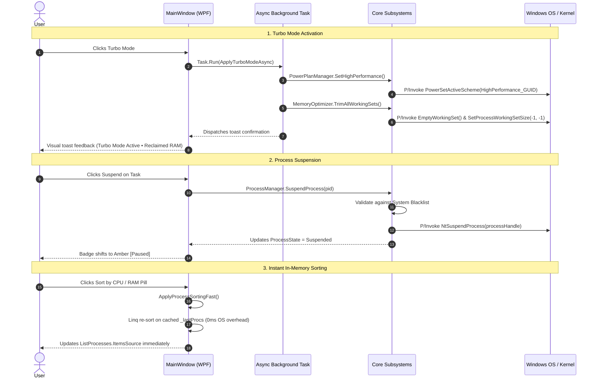
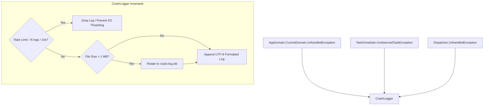

# ⚡ System Core Monitor — Command Center & Action Buttons Technical Manual

This document provides a comprehensive technical breakdown of the interactive controls, Win32 / NT kernel P/Invoke mechanisms, concurrency invariants, windowing architectures, crash resilience, and security guardrails implemented in **System Core Monitor v3.4.0**.

---

## 📑 Table of Contents
1. [Overview & Execution Philosophy](#1-overview--execution-philosophy)
2. [Command Center Architecture & Lifecycle](#2-command-center-architecture--lifecycle)
3. [Deep Dive: Quick Ribbon Actions](#3-deep-dive-quick-ribbon-actions)
   - [3.1 Turbo Mode (High Performance + Working Set Purge)](#31-turbo-mode-high-performance--working-set-purge)
   - [3.2 Instant DNS Resolver Flushing](#32-instant-dns-resolver-flushing)
   - [3.3 Multizone Hardened Temp Storage Cleaner](#33-multizone-hardened-temp-storage-cleaner)
   - [3.4 Hung Application Rescue Watchdog](#34-hung-application-rescue-watchdog)
   - [3.5 Storage Analyzer: Folder Breakdown & Hidden Bloat Detection](#35-storage-analyzer-folder-breakdown--hidden-bloat-detection)
4. [Deep Dive: Real-Time Process Management](#4-deep-dive-real-time-process-management)
   - [4.1 Thread Freezing (NtSuspendProcess) & Resuming (NtResumeProcess)](#41-thread-freezing-ntsuspendprocess--resuming-ntresumeprocess)
   - [4.2 Dynamic CPU Scheduler Priority Control](#42-dynamic-cpu-scheduler-priority-control)
   - [4.3 Concurrency Protection & In-Memory Fast Sorting](#43-concurrency-protection--in-memory-fast-sorting)
5. [AI Agent & MCP Session Telemetry Engine](#5-ai-agent--mcp-session-telemetry-engine)
   - [5.1 Toolhelp32 Snapshot Traversal, PID Reuse Mitigation & Cache Eviction Safeguard](#51-toolhelp32-snapshot-traversal-pid-reuse-mitigation--cache-eviction-safeguard)
   - [5.2 Decoupled Process Metrics (Total Children vs Verified MCP Servers)](#52-decoupled-process-metrics-total-children-vs-verified-mcp-servers)
   - [5.3 Command-Line Evidence-Based MCP Detection (Go/Rust Binary Support)](#53-command-line-evidence-based-mcp-detection-gorust-binary-support)
   - [5.4 MCP Package Runner Isolation (npx, uvx) & Shell Launcher Filtering](#54-mcp-package-runner-isolation-npx-uvx--shell-launcher-filtering)
   - [5.5 Independent CLI Session Promotion, Resumed Session Hash Detection & Session Boundary Tree Pruning](#55-independent-cli-session-promotion-resumed-session-hash-detection--session-boundary-tree-pruning)
   - [5.6 Deterministic Win32 Handle Disposal (SafeProcessHandle)](#56-deterministic-win32-handle-disposal-safeprocesshandle)
   - [5.7 Anti-Reentrancy Concurrency Gate (_sampleGate)](#57-anti-reentrancy-concurrency-gate-_samplegate)
   - [5.8 Process Cold-Start, AI Model Badge Extraction & Null/Empty DataTrigger Resilience](#58-process-cold-start-ai-model-badge-extraction--nullempty-datatrigger-resilience)
   - [5.9 Reverse Topological Process Tree Termination](#59-reverse-topological-process-tree-termination)
6. [Native Windowing & Multi-Monitor Custom Chrome](#6-native-windowing--multi-monitor-custom-chrome)
   - [6.1 WM_GETMINMAXINFO & Per-Monitor Work Area Calculation](#61-wm_getminmaxinfo--per-monitor-work-area-calculation)
   - [6.2 Dynamic Border, Corner Radius & Shadow Transitions](#62-dynamic-border-corner-radius--shadow-transitions)
7. [Enterprise Crash Logging Architecture](#7-enterprise-crash-logging-architecture)
   - [6.1 3-Layer Exception Trapping](#71-3-layer-exception-trapping)
   - [6.2 Sliding Rate Limiter & Disk Protection](#72-sliding-rate-limiter--disk-protection)
   - [6.3 1MB Size Cap & Log Rotation](#73-1mb-size-cap--log-rotation)
8. [Security Invariants & Crash Prevention](#8-security-invariants--crash-prevention)
   - [8.1 Protected System Process Blacklist](#81-protected-system-process-blacklist)
   - [8.2 NTFS Reparse Point (Junction / Symlink) Isolation](#82-ntfs-reparse-point-junction--symlink-isolation)
   - [8.3 Dual Timestamp Gate & TOCTOU Defense](#83-dual-timestamp-gate--toctou-defense)

---

## 1. Overview & Execution Philosophy

System Core Monitor v2.0.0 is engineered with an **Active Command Center** philosophy:
- **Zero Heavy Runtimes:** Executes as a single compiled C# WPF binary (<600 KB) with zero third-party dependencies.
- **Sub-Millisecond Direct OS Integration:** Interacts directly with native Windows dynamic-link libraries (`ntdll.dll`, `kernel32.dll`, `user32.dll`, `powrprof.dll`, `dnsapi.dll`, `psapi.dll`).
- **Zero-Elevation Where Possible:** Critical actions like Power Plan switching, DNS flushing, memory trimming, and process suspension operate cleanly in standard user context without triggering aggressive UAC prompts.

---

## 2. Command Center Architecture & Lifecycle

The following Mermaid diagram illustrates how user actions propagate through the UI layer, background worker threads, and native Win32/kernel APIs:



---

## 3. Deep Dive: Quick Ribbon Actions

### 3.1 Turbo Mode (High Performance + Working Set Purge)
- **Primary Goal:** Maximize CPU responsiveness for latency-sensitive tasks (gaming, compiling, 3D rendering) while freeing maximum physical RAM.
- **Win32 APIs:**
  - `PowrProf.dll` (`PowerSetActiveScheme`): Unparks CPU cores and switches to High Performance scheme.
  - `psapi.dll` (`EmptyWorkingSet`) / `kernel32.dll` (`SetProcessWorkingSetSize`): Flushes unreferenced memory pages from working sets.
- **Execution Mechanism:**
  1. Activates High Performance GUID (`8c5e7fda-e8bf-4a96-9a85-a6e23a8c635c`).
  2. Concurrently enumerates non-system user processes and executes `EmptyWorkingSet(handle)` to release physical RAM pages.
  3. Triggers CLR Garbage Collection (`GC.Collect()`) on the monitoring process.

### 3.2 Instant DNS Resolver Flushing
- **Primary Goal:** Clear stale routing tables, DNS resolution errors, and cached records without opening administrative terminal sessions.
- **Win32 API:**
  - `dnsapi.dll` (`DnsFlushResolverCache`): Native call executing in <0.01 ms, clearing the Windows DNS resolver cache equivalent to `ipconfig /flushdns`.

### 3.3 Multizone Hardened Temp Storage Cleaner
- **Primary Goal:** Safely purge obsolete temporary files without compromising running installers, user configurations, or system integrity.
- **Target Directories:**
  1. `%TEMP%` (Current User temporary storage).
  2. `C:\Windows\Temp` (System temporary staging area).
  3. `C:\Windows\WinSxS\Temp` (Component servicing temporary files).
  4. `C:\Windows\SoftwareDistribution\Download` (Orphaned Windows Update staging payloads).
  5. `C:\ProgramData\Microsoft\Windows\DeliveryOptimization` (P2P cache fragments).
- **Safety Mechanisms:**
  - Files are filtered with a strict **24-hour minimum age cutoff**.
  - In-use files locked by active processes are skipped cleanly without throwing fatal exceptions.
  - Absolute exclusions guard developer caches (`.claude`, `.antigravity`), cloud sync clients (`OneDrive`, `GoogleDrive`), and modern Windows App packages (`Packages`).

### 3.4 Hung Application Rescue Watchdog
- **Primary Goal:** Identify and recover frozen applications that lock up the desktop.
- **Mechanism:**
  - During telemetry refresh, the process enumerator inspects `process.Responding` (which sends a non-blocking `WM_NULL` probe via Win32 `SendMessageTimeout`).
  - If a process with an active window handle returns `Responding == false`, an alert banner illuminates in the title bar.
  - Clicking *Rescue* terminates the hung process gracefully via `Process.Kill()`, immediately restoring desktop responsiveness.

### 3.5 Storage Analyzer: Folder Breakdown & Hidden Bloat Detection
- **Primary Goal:** Answer *where* the space went, which a per-volume usage bar cannot express. A drive reporting "92% used" restates a number the user already knows; it never names the folder or the artifact responsible.

#### Traversal Invariants
- **`SearchOption.AllDirectories` is forbidden.** The framework raises `UnauthorizedAccessException` from inside the deferred iterator, killing the entire enumeration with no way to skip the branch and resume — one protected folder silently truncates a whole-drive scan. `PathTooLongException` behaves identically on deeply nested dependency trees. Traversal is therefore manual recursion over `TopDirectoryOnly`, with exception handling **around `MoveNext()` itself**, bounded by `MaxDirectoryDepth = 40`.
- **Reparse points never contribute bytes.** Junctions, symlinks and cloud placeholders project data stored elsewhere — another volume, a remote service, a paired mobile device. Following them reports capacity the physical disk does not contain. Every entry is tested with `FileSystemSafety.IsReparsePoint` and recorded as a `SkippedEntry` with reason `ReparsePoint`.
- **The attribute check fails closed.** If attributes cannot be read, the entry is treated as a reparse point and traversal refuses to descend. Inverting this default would reopen the junction-traversal sandbox escape that `SafeTempCleaner` is hardened against.
- **The scan total is never presented as a reconciliation** of the volume's used bytes. Hard links, sparse files and skipped branches guarantee a discrepancy, so the skipped count is surfaced in the UI to explain it rather than leave it mysterious.

#### Concurrency & Responsiveness
- First-level subtrees are independent, so they are measured with `Parallel.For` bounded by `Environment.ProcessorCount`; recursion *within* a subtree stays sequential, because the bottleneck is metadata I/O rather than CPU.
- Shared state is guarded accordingly: `Interlocked` for the byte and directory counters, a lock for the skipped-entry list.
- Progress is **throttled by elapsed time (~150 ms), never per item** — an unthrottled report floods the WPF `Dispatcher` on trees full of small directories. The report carries the current path and accumulated bytes, deliberately not a percentage: a total is unknowable without an equally expensive pre-scan.
- Cancellation is cooperative and checked per directory rather than per file. Workers return normally instead of throwing, so `Parallel.For` never wraps the outcome in an `AggregateException`.

#### Hidden Bloat Detectors
`BloatDetector` surfaces consumers that are structurally invisible to a usage bar, each classified by severity and paired with a concrete remediation:

| Detector | Why a usage bar misses it | Action class |
| :--- | :--- | :--- |
| Docker / WSL VHDX | Dynamically expanding images grow as data is written but never release blocks when it is deleted, so file size says nothing about internal usage | `LaunchTool` |
| Build caches (Gradle, NuGet, npm, pip, Maven, Android) | Regenerable, scattered across the profile, individually unremarkable | `SafeDelete` |
| Recycle Bin | Queried through `SHQueryRecycleBin`; invisible as a normal folder | `SafeDelete` |
| `pagefile.sys` / `hiberfil.sys` | Large and system-owned — labeled explicitly so users stop hunting them | `Informational` |
| WinSxS component store | Only DISM knows which components are still referenced | `LaunchTool` |

- **Internal VHDX usage is deliberately not inferred.** Doing so would require mounting the image or shelling out to an external CLI, neither of which belongs in a dependency-free binary. Reporting the on-disk file size with an explanation is both honest and actionable.

#### Deletion Safety
- `BloatDetector.IsWhitelistedForDeletion` is an **exact normalized match** against a constant list of regenerable cache roots — not a prefix check, and never a path derived from user input or from a scan result.
- Deletion runs through `SafeTempCleaner.CleanWhitelistedCache`, inheriting the dual-timestamp age gate and the junction guard. That age gate is not incidental: it is what prevents a cleaner from destroying data that a process is actively writing.
- `IsSafeTempRoot` remains a second, independent barrier, rejecting drive roots and system/profile directories even if a caller were to skip its whitelist check.
- Items classified `Informational` expose **no delete affordance at all**, and anything requiring elevation (compacting a VHDX, running DISM) is surfaced as the exact command rather than executed — the application holds no elevation subsystem by design.

---

## 4. Deep Dive: Real-Time Process Management

### 4.1 Thread Freezing (`NtSuspendProcess`) & Resuming (`NtResumeProcess`)
- **Native Kernel APIs (`ntdll.dll`):**
  - `NtSuspendProcess(IntPtr processHandle)`: Freezes all active execution threads of the target process at the kernel scheduling level.
  - `NtResumeProcess(IntPtr processHandle)`: Unfreezes threads, restoring active execution.
- **Operational Flow:**
  - Unlike `Process.Kill()`, `NtSuspendProcess` drops CPU consumption to **0.0%** instantly without closing the window or losing unsaved work.
  - Clicking `NtResumeProcess` or the global *"🚨 Resume All"* safety button reactivates all suspended threads.

### 4.2 Dynamic CPU Scheduler Priority Control
- **Mechanism:** Modifies the process base priority in the Windows scheduler via `process.PriorityClass`:
  - `RealTime` (Priority 24 — Requires elevation, reserved for critical timing).
  - `High` (Priority 13 — Prioritized for compilation, gaming, rendering).
  - `AboveNormal` (Priority 10).
  - `Normal` (Priority 8 — Standard Windows default).
  - `BelowNormal` (Priority 6 — Background renderers).
  - `Idle` (Priority 4 — Runs only when CPU has idle cycles).

### 4.3 Concurrency Protection & In-Memory Fast Sorting
- **`CpuUsageTracker` Concurrency Barrier:**
  - `ProcessCollector.cs` and `AiAgentCollector.cs` both delegate CPU delta math to a shared `Core/CpuUsageTracker.cs`, which synchronizes its internal PID -> `Tuple<TimeSpan, DateTime>` dictionary with its own private lock object.
  - Dead PID cleanup passes safely purge exited processes without race conditions against asynchronous collector tasks.
- **`ApplyProcessSortingFast()` In-Memory Linq Sorting:**
  - When switching between CPU % and RAM sorting modes, `MainWindow.xaml.cs` re-sorts the in-memory `_lastProcs` cache directly.
  - Avoids triggering costly Win32 process enumeration loops during UI interactions.

---

## 5. AI Agent & MCP Session Telemetry Engine

System Core Monitor v3.3.0 features an enterprise-grade discovery and telemetry engine designed specifically for modern autonomous developer agents and Model Context Protocol (MCP) architectures.

### 5.1 Toolhelp32 Snapshot Traversal, PID Reuse Mitigation & Cache Eviction Safeguard
- **Atomic Traversal:** Captures the full Windows process hierarchy in $<0.8\text{ ms}$ via `CreateToolhelp32Snapshot(TH32CS_SNAPPROCESS, 0)`.
- **Triple PID Reuse Gate:** Because Windows recycles PIDs rapidly upon process exit, System Core Monitor verifies `child.StartTime >= parent.StartTime.AddSeconds(-2)` to prevent associating recycled PIDs with older parent orchestrators.
- **Snapshot Resilience & Cache Eviction Safeguard (`allRunningPids.Count > 0`):** Under severe OS memory pressure or transient kernel handle exhaustion, `CreateToolhelp32Snapshot` can fail or return an empty process list. Without defensive gating, a dead PID cleanup pass (`!allRunningPids.Contains(k)`) would incorrectly interpret the empty set as all processes having terminated, immediately wiping:
  1. The shared `CpuUsageTracker` samples: Erasing baseline CPU kernel and user time-series measurements, resulting in 0.0% spikes on recovery.
  2. `_sessionContextCache` and `_childProcessCache`: Dropping resolved workspace names, session labels, and MCP roles.
  3. `_independentSessionCache`: Forcing expensive CLI session re-evaluation.
  4. `CollapsedSessionPids`: Abruptly resetting the user's UI tree expansion/collapse states.

  By wrapping all cache cleanup passes behind `if (allRunningPids.Count > 0)`, System Core Monitor treats transient snapshot failures as non-destructive skips, preserving telemetry baselines and UI states until the subsequent successful polling cycle.

### 5.2 Decoupled Process Metrics (Total Children vs Verified MCP Servers)
Autonomous agents spawn a complex mixture of child processes: UI webviews, language servers, background cron utilities, diagnostic handlers, and actual MCP tool servers.
- `session.ChildProcessCount`: Total child processes spawned within the session tree.
- `session.McpServersCount`: Count of verified MCP servers identified by positive command-line evidence (`session.ChildProcesses.Count(c => c.IsMcpServer)`).
- Both metrics are presented independently in the UI (`Subprocesos: N · MCP: M`), providing granular visibility into process footprint without conflating generic workers with MCP servers.

### 5.3 Command-Line Evidence-Based MCP Detection (Go/Rust Binary Support)
Relying on runtime executable names (`node.exe`, `python.exe`) produces severe inaccuracies:
- **False Positives:** Plain Node/Python processes executing build scripts, linters, or language servers would be falsely classified as MCP servers.
- **False Negatives:** High-performance MCP servers compiled as native binaries in **Go** or **Rust** (e.g., SQLite MCP, Git MCP, filesystem servers) do not run under Node or Python and would be omitted.

System Core Monitor inspects sanitized command-line arguments extracted via `NtQueryInformationProcess` (Class 60) for verified MCP markers:
- `mcp-remote`, `modelcontextprotocol`, `mcp-server`, `mcp_server`, `--stdio`, `/mcp`, `\mcp`.
Processes matching these markers are classified as `"Servidor MCP (<processName>)"` with `IsMcpServer = true` and badge color `#10B981`. Plain Node/Python processes without markers fall back to `"Node.js Process"` or `"Python Process"` (`IsMcpServer = false`).

### 5.4 MCP Package Runner Isolation (`npx`, `uvx`) & Shell Launcher Filtering
Package runners like `npx` (`npx-cli.js`, `\npx\`) and `uvx` (`uvx.exe`) remain alive alongside the child MCP server they spawn.
- Treating both the runner and the spawned server as MCP instances would double-count a single logical server.
- The collector classifies runner processes as `"Lanzador de paquete MCP"` (`#64748B`, `IsMcpServer = false`), ensuring only the actual executing server is tallied in `McpServersCount`.
- Intermediate shells (`cmd.exe`, `powershell.exe`, `pwsh.exe`, `bash.exe`, `wsl.exe`, `conhost.exe`) propagate the server's command-line flags in their arguments but are filtered out via `ShellProcessNames`, ensuring launchers are never identified as MCP servers.

### 5.5 Independent CLI Session Promotion, Resumed Session Hash Detection & Session Boundary Tree Pruning
Autonomous coding CLIs (such as `claude`, `gemini`, `agy`) are frequently launched as subprocesses of parent IDEs (e.g., Google Antigravity, Cursor, Windsurf, VS Code).
- **Session Identification:** If a child process carries CLI session flags (`--output-format stream-json`, `--resume=`, `--session-id`), `IsIndependentAgentSession(pid)` detects it as an independent session and promotes it to `rootAgentPids`.
- **Resumed Session Hash Resolution:** When agents run in headless or terminal CLI mode without an active GUI window title (`MainWindowTitle` is empty), System Core Monitor parses the command line for resumed session identifiers using `@"\-\-resume[=\s]+([a-fA-F0-9\-]{8,})"`. It truncates the identifier to its final 8 characters:
  ```csharp
  else if (!string.IsNullOrWhiteSpace(resumeId))
  {
      context = "🔗 Sesión " + resumeId.Substring(Math.Max(0, resumeId.Length - 8));
  }
  ```
  This replaces ambiguous or generic process labels with human-readable session hashes (e.g., `🔗 Sesión a1b2c3d4`).
- **Session Boundary Tree Pruning:** During recursive descendant collection (`CollectDescendantsWithMetrics`), the set of promoted root PIDs (`rootPidSet`) is passed as `sessionBoundaries`. If a child PID exists in `sessionBoundaries`, traversal immediately stops at that branch:
  ```csharp
  if (sessionBoundaries != null && sessionBoundaries.Contains(childPid))
  {
      continue; // Owned by its own session row; counting it here would duplicate RAM/CPU
  }
  ```
  This eliminates duplicate memory and CPU metrics between parent IDE sessions and nested CLI sessions.

### 5.6 Deterministic Win32 Handle Disposal (`SafeProcessHandle`)
In high-frequency telemetry loops (polling every 1–2 seconds), unmanaged `SafeProcessHandle` descriptors instantiated via `Process.GetProcessById()` or `Process.GetProcesses()` can accumulate rapidly if not explicitly freed.
- Every invocation in `AiAgentCollector.cs` (`rootProc`, `childProc`, `cp`) is wrapped in scoped `using (...)` blocks or disposed in `finally`; `CollectDescendantsWithMetrics` opens each descendant's handle once, reusing it for both `StartTime` validation and RAM/CPU metrics instead of reopening it.
- `ProcessCollector.cs` disposes every `Process` instance returned by `Process.GetProcesses()` in a `finally` block once its metrics have been read.
- Validated via automated 200-cycle stress test with a net handle delta of zero leaks.

### 5.7 Anti-Reentrancy Concurrency Gate (`_sampleGate`)
When manual UI refreshes (e.g. clicking *"Actualizar"* or expanding/collapsing nodes) overlap with the periodic timer loop, concurrent passes over `Sample()` would compute delta deltas against the shared `CpuUsageTracker` within milliseconds, yielding spurious 0.0% CPU calculations.
- A private `_sampleGate` lock serializes `Sample()` execution passes, ensuring strict temporal integrity for CPU delta mathematics.

### 5.8 Process Cold-Start, AI Model Badge Extraction & Null/Empty DataTrigger Resilience
- **PEB Cold-Start Protection:** Newly spawned processes exhibit a brief window where `NtQueryInformationProcess` returns `null` because the user-mode PEB is still initializing. `IsIndependentAgentSession` avoids negative caching when `cmd == null`, deferring classification to the next sampling cycle.
- **AI Model Badge Extraction (`--model`):** The collector inspects the sanitized command line for active LLM identifiers via regex `@"\-\-model[\s=]+([a-zA-Z0-9_\-\.]+)"` (e.g. `claude-3-7-sonnet`, `gpt-4o`, `gemini-2.0-flash`), exposing it via `AiAgentSession.ModelName`.
- **WPF Null/Empty Resilient DataTriggers:** In `MainWindow.xaml`, the model badge is styled with dual `DataTrigger` conditions to handle both empty strings (`Value=""`) and unset references (`Value="{x:Null}"`):
  ```xml
  <Border Background="{DynamicResource BgCard}" CornerRadius="4" Padding="5,1.5" Margin="0,0,8,0">
      <Border.Style>
          <Style TargetType="Border">
              <Setter Property="Visibility" Value="Visible"/>
              <Style.Triggers>
                  <DataTrigger Binding="{Binding ModelName}" Value="">
                      <Setter Property="Visibility" Value="Collapsed"/>
                  </DataTrigger>
                  <DataTrigger Binding="{Binding ModelName}" Value="{x:Null}">
                      <Setter Property="Visibility" Value="Collapsed"/>
                  </DataTrigger>
              </Style.Triggers>
          </Style>
      </Border.Style>
      <TextBlock Text="{Binding ModelName, StringFormat='🧬 {0}'}" FontSize="9.5" FontWeight="SemiBold" Foreground="{DynamicResource TextSecondary}"/>
  </Border>
  ```
  This guarantees that CLI tools, local models, or IDE sessions launched without explicit `--model` flags collapse their container borders cleanly without leaving empty graphical pill artifacts or padding gaps in the header row.
- **UI Badge State Binding:** The session card in XAML binds `Foreground="{Binding StatusBadgeColor}"`, dynamically reflecting Active (`#10B981` Emerald) versus Idle (`#64748B` Slate) states based on the CPU workload threshold ($<0.04$).
- **PID Recycling Protection:** When processes terminate, dead PIDs are purged from `CollapsedSessionPids`, ensuring newly launched processes never inherit obsolete UI collapse states.

### 5.9 Reverse Topological Process Tree Termination
When terminating an AI agent session via `"⚡ Terminar Árbol"`, the engine recursively builds the descendant hierarchy and terminates processes in **reverse topological order** (deepest leaf MCP subprocesses first $\rightarrow$ intermediary runners $\rightarrow$ root orchestrator last). This prevents orphaned zombie processes, hanging STDIO pipes, and locked repository indexes.

The hierarchy is **not** the raw `PPID` graph. Windows never clears the parent PID a process recorded at creation, and it hands the freed number to unrelated processes, so a snapshot contains edges pointing from live processes to parents that died long ago. `CollectTreeNodes` therefore enforces the creation-order invariant — *a process cannot start before its own parent* — and refuses to descend into any child whose `StartTime` precedes its recorded parent's. Without it, terminating a tree rooted at a recycled PID reaches strangers, and on the destructive path a wrong edge does not display a bad number: it kills someone's work.

The same identity problem applies across time. `TerminateProcessTree` accepts an optional `expectedStartTime`, and a termination driven by a previously sampled list passes the `StartTime` captured at scan time. Between the collector tick, a modal confirmation and a bulk loop that waits on each exit, a PID can change owner; when the root no longer matches, the whole operation aborts and reports it instead of terminating anything.

### 5.10 Orphaned Runtime Process Detection
`AiAgentCollector.CollectOrphans` reports the runtime processes an interrupted agent session abandoned: those no live session claims (diffed against the PIDs every session tree reclaimed in the same pass) whose parent is either absent from the snapshot or, once again, recycled onto a process that started later than its supposed child. The motivating case is a `multiprocessing.Pool` on Windows — which only supports the `spawn` start method — whose workers outlive a failed run. Windows provides no orphan reaper (there is no equivalent to `PR_SET_PDEATHSIG`), so across repeated retries these accumulate silently.

Three properties keep the classifier honest:

- **Minimum age gate.** A launcher that exits immediately after spawning its child (`npx`, `uvx`, a shell) legitimately leaves a parentless process behind for an instant. Below one minute, absence of a parent is ordinary startup, not abandonment.
- **Snapshot failure is not evidence.** If the Toolhelp32 pass returned nothing, the detector returns an empty list rather than declaring every process orphaned.
- **Detection reports, the user decides.** A dead parent is normal for plenty of legitimate processes launched from a terminal that has since closed, so each row carries its detection reason, age, RAM and sanitized command line, and nothing is terminated without explicit confirmation.

---

## 6. Native Windowing & Multi-Monitor Custom Chrome

### 6.1 `WM_GETMINMAXINFO` & Per-Monitor Work Area Calculation
Custom chrome WPF windows (`WindowStyle="None"`, `AllowsTransparency="True"`) inherently encounter Windows DWM boundary issues where maximizing causes the window to span beneath the taskbar or overflow onto secondary monitors.

**Win32 Solution in `MainWindow.xaml.cs`:**
1. Installs an `HwndSource` message hook in `OnSourceInitialized`.
2. Intercepts `WM_GETMINMAXINFO` (`0x0024`).
3. Calls `MonitorFromWindow(hwnd, MONITOR_DEFAULTTONEAREST)` to detect the active monitor.
4. Invokes `GetMonitorInfo(hMonitor, ref mi)` to obtain exact `rcWork` (excluding taskbar) and `rcMonitor` rectangles.
5. Populates `MINMAXINFO` structure:
   - `ptMaxPosition.X = Math.Abs(rcWork.Left - rcMonitor.Left)`
   - `ptMaxPosition.Y = Math.Abs(rcWork.Top - rcMonitor.Top)`
   - `ptMaxSize.X = Math.Abs(rcWork.Right - rcWork.Left)`
   - `ptMaxSize.Y = Math.Abs(rcWork.Bottom - rcWork.Top)`
   - `ptMinTrackSize = (380, 88)`

### 6.2 Dynamic Border, Corner Radius & Shadow Transitions
In `MainWindow_StateChanged`:
- **When Maximized:** `Margin = 0`, `CornerRadius = 0`, `BorderThickness = 0`, `Effect = null` (eliminating shadow bleed into adjacent displays).
- **When Restored/Normal:** `Margin = 8`, `CornerRadius = 14`, `BorderThickness = 1`, `Effect = _cachedShadowEffect` (restoring modern rounded corners and elevation shadow).

---

## 7. Enterprise Crash Logging Architecture

`CrashLogger.cs` provides a production-grade diagnostic and crash prevention subsystem:



### 7.1 3-Layer Exception Trapping
- **`AppDomain.UnhandledException`**: Captures critical unhandled errors before process termination.
- **`TaskScheduler.UnobservedTaskException`**: Catches unobserved background async faults and marks `e.SetObserved()` to avoid CLR termination.
- **`Dispatcher.UnhandledException`**: Traps recoverable UI thread glitches, marks `e.Handled = true`, and logs the fault without taking down the application.

### 7.2 Sliding Rate Limiter & Disk Protection
Maintains a rolling 10-second window (`_recentCrashCount`). If more than 5 exceptions occur within 10 seconds, logging is throttled to prevent disk saturation and I/O thrashing.

### 7.3 1MB Size Cap & Log Rotation
Before appending to `%LOCALAPPDATA%\SystemCoreMonitor\Logs\crash.log`, `CrashLogger` inspects file size. If size exceeds 1,048,576 bytes, the existing log is moved to `crash.log.old`, maintaining an evergreen, zero-maintenance footprint.

---

## 8. Security Invariants & Crash Prevention

### 8.1 Protected System Process Blacklist
To prevent accidental system crashes or Blue Screens of Death (BSOD), `ProcessManager.cs` enforces an inviolable blacklist combined with `proc.SessionId == 0` and `pid <= 4` boundary checks:

| Protected Process | Subsystem Role | Consequence of Termination |
| :--- | :--- | :--- |
| `system` (PID 4) | NT Kernel & System Threads | Immediate BSOD (`CRITICAL_PROCESS_DIED`) |
| `idle` (PID 0) | System Idle Process | Unscheduled CPU state corruption |
| `smss` | Session Manager Subsystem | Immediate kernel halt |
| `csrss` | Client Server Runtime Subsystem | Immediate BSOD (`CRITICAL_PROCESS_DIED`) |
| `wininit` | Windows Initialization Process | Critical OS initialization failure |
| `services` | Service Control Manager | Fatal background services failure |
| `lsass` | Local Security Authority | Security shutdown / reboot prompt |
| `svchost` | Generic Host for Windows Services | Network, audio, and core driver failure |
| `fontdrvhost` | Usermode Font Driver Host | Typography subsystem crash |
| `dwm` | Desktop Window Manager | Desktop visual collapse and display reset |
| `explorer` | Windows Shell & Taskbar | Loss of Desktop and Start Menu |
| `sihost` | Shell Infrastructure Host | Windows UI component breakdown |
| `taskhostw` | Host Process for Windows Tasks | Background task dispatch disruption |
| `RuntimeBroker` | Windows App Permissions Manager | UWP application security failure |
| `audiodg` | Windows Audio Device Graph | Immediate loss of system audio |
| `spoolsv` | Print Spooler Service | Printing queue subsystem crash |

### 8.2 NTFS Reparse Point (Junction / Symlink) Isolation
Validates `FileAttributes.ReparsePoint` on every directory entry during cleanup. If a directory is a Junction (`mklink /J`) or Symlink, `SafeTempCleaner` never traverses into it, preventing sandbox escapes.

### 8.3 Dual Timestamp Gate & TOCTOU Defense
Enforces that **BOTH** `LastWriteTime < cutoff` **AND** `CreationTime < cutoff` are satisfied simultaneously, ensuring active installers unpacking archived files into `%TEMP%` are never corrupted.
